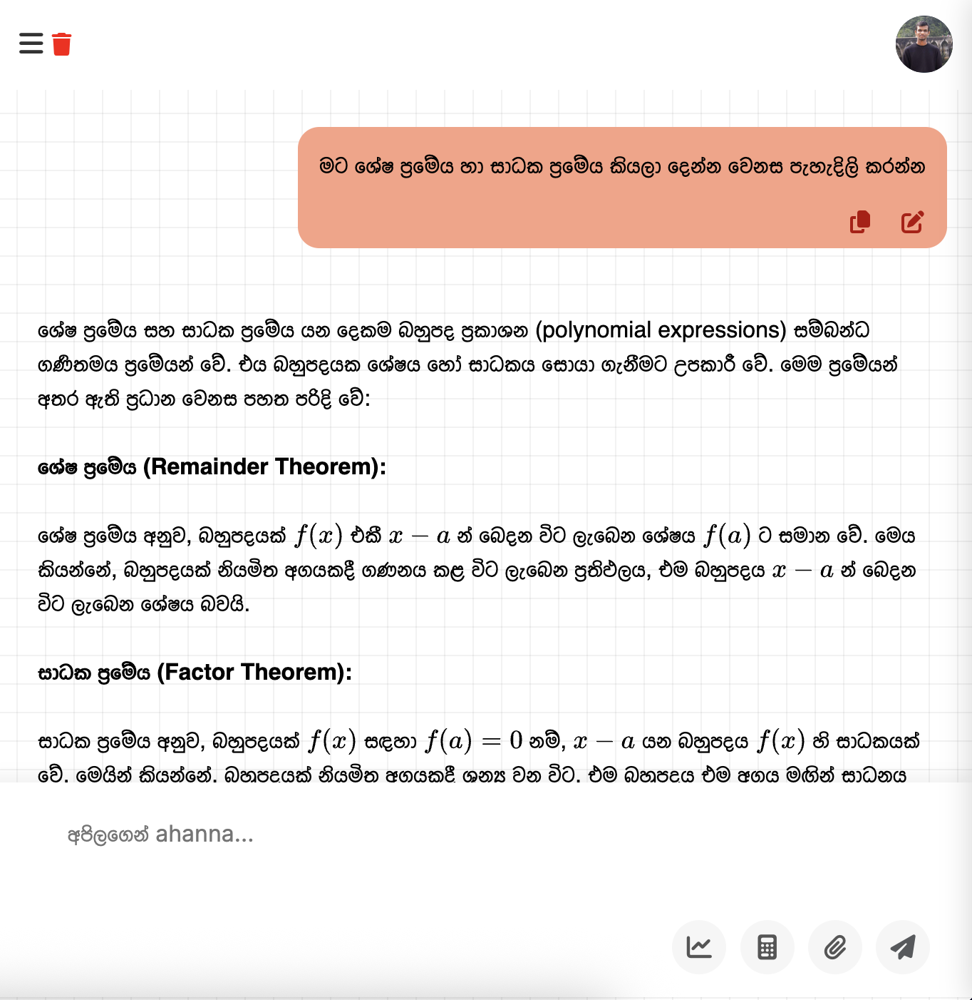
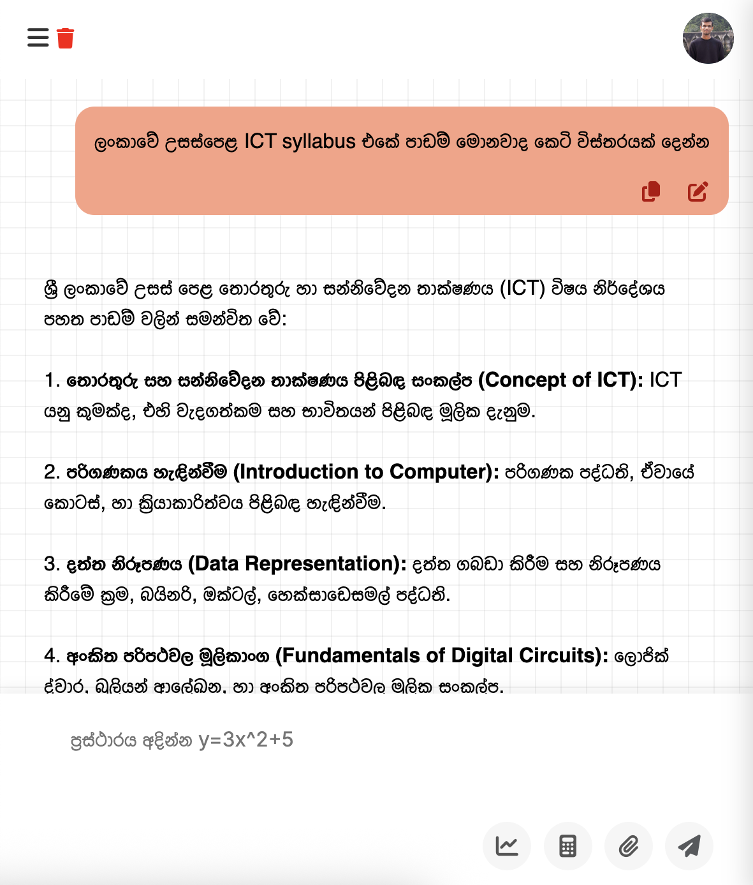

<p align="center">
  
</p>

<h1 align="center">ApilageAI — High-Secured Education AI Platform</h1>

<p align="center">
  <strong>Sri Lanka's premier native-language AI learning ecosystem designed for Grades 1–13, curriculum-aligned and enterprise-secured.</strong>
</p>

<p align="center">
  <a href="#-key-features"></a>
  <a href="#-architecture--tech-stack"></a>
  <a href="#-architecture--tech-stack"></a>
  <a href="#-architecture--tech-stack"></a>
  <a href="#-architecture--tech-stack"></a>
  <a href="SECURITY.md"></a>
</p>

---

##  Overview

**ApilageAI** is an advanced multimodal educational intelligence platform purpose-built to revolutionize K-12 learning in Sri Lanka. It combines cutting-edge Google Gemini large language models, dynamic search grounding, interactive canvas rendering, and real-time multiplayer gamification to provide curriculum-accurate learning in **Sinhala, Tamil, and English**.

Built with a high-security enterprise architecture, the platform features multi-tiered rate limiting, session protection, CSRF hardening, robust developer APIs, and integrated payment processing.

---

##  Interface Preview

<p align="center">
  
  
</p>

---

##  Key Features

###  Multimodal AI & Intelligent Tutoring
- **Curriculum-Aligned Responses:** Strictly guided by Sri Lankan National Institute of Education (NIE) syllabuses for Grades 1–13.
- **Trilingual Comprehension:** Full native support for Sinhala, Tamil, and English.
- **Live Search Grounding:** Real-time web citations prioritizing verified educational and government resources.
- **Thinking Mode & Token Budgeting:** Visualized step-by-step reasoning for complex math and science problem solving.
- **Multimodal Document Parsing:** Upload PDFs, textbook chapters, and images with automatic text extraction and OCR.

### Visual & Interactive Studio
- **Excalidraw Whiteboard Integration:** Real-time collaborative sketching, diagram generation, and mindmap exports.
- **KaTeX / LaTeX Mathematical Typesetting:** Clean mathematical and chemical formula rendering.
- **Dynamic Mindmaps & Flowcharts:** Automatic breakdown of complex subjects into digestible visual structures.

###  Gamified Learning & Multiplayer
- **Quiz Blust:** Real-time multiplayer competitive quiz battles powered by WebSockets.
- **Daily Learning Streaks:** Engagement milestones with streak tracking and badge rewards.
- **Automated MCQ Generation:** Rapid quiz synthesis customized by grade level, topic, and difficulty.

###  Enterprise Security Hardening
- **Multi-Tier Rate Limiting:** Redis-backed token bucket rate limiters protecting socket events and REST endpoints.
- **Credential & Session Isolation:** Strict HTTP-only, SameSite cookies, session locking, and brute-force lockouts.
- **Input Sanitization:** Deep input validation, prompt injection shields, and XSS sanitization.
- **Developer API Defense:** SHA-256 hashed API keys with strict domain whitelisting and automated leak detection.

###  Billing & Monetization
- **Payment Gateways:** Integrated Sri Lankan **Payable** payment gateway and international **PayPal** processing.
- **Granular Token Accounting:** Transparent per-token and thinking-mode credit calculations with student-friendly trial tiers.

---

## Architecture & Tech Stack

```text
┌────────────────────────────────────────────────────────────────────────┐
│                          Client Applications                           │
│     (Web Browser / Mobile / Desktop - Responsive Tailwind + JS)        │
└───────────────────▲────────────────────────────────▲───────────────────┘
                    │ HTTPS / REST                   │ WebSockets (WSS)
                    ▼                                ▼
┌───────────────────────────────────────┐ ┌──────────────────────────────┐
│       Core PHP Web Application        │ │  Node.js Real-time AI Server │
│          (apilageai.lk)               │ │    (socket.apilageai.lk)     │
│ ───────────────────────────────────── │ │ ──────────────────────────── │
│ • PHP 8.2+ MVC Architecture           │ │ • Express.js & Socket.io     │
│ • Smarty Templating Engine            │ │ • Google GenAI SDK (@google) │
│ • Authentication & User Sessions      │ │ • Redis Multi-Tier Limiter   │
│ • Developer REST API Endpoints        │ │ • PDF & Image OCR Pipelines  │
│ • Payable & PayPal Payment Gateways   │ │ • Live AI Streaming Response │
└───────────────────┬───────────────────┘ └──────────────┬───────────────┘
                    │                                    │
                    ▼                                    ▼
┌────────────────────────────────────────────────────────────────────────┐
│                   Storage & Infrastructure Layer                       │
│  • MySQL / MariaDB (Database Engine)                                   │
│  • Redis (Distributed Cache & Socket Rate Limiting)                    │
│  • Google Gemini Cloud Services (Gemini 2.5 / 2.0 / Flash)             │
└────────────────────────────────────────────────────────────────────────┘
```

---

##  Repository Structure

```plaintext
├── .env.example                      # Unified environment configuration template
├── .gitignore                         # Comprehensive ignore rules for sensitive files
├── SECURITY.md                        # Project security guidelines and practices
├── config.example.php                 # PHP application configuration template
├── README.md                          # Project documentation
│
├── apilageai.lk/                      # PHP Core Web Platform
│   ├── backend/                       # Core application logic
│   │   ├── bootstrap.php              # Initialization, error handlers, and security headers
│   │   ├── config.example.php         # Safe backend config template (copy to config.php)
│   │   ├── functions.php              # Shared utility and sanitization helpers
│   │   ├── user.php                   # Authentication, security, and profile handling
│   │   ├── youtube_helper.php         # Safe YouTube educational video search helper
│   │   └── includes/
│   │       ├── libs/                  # Third-party libraries (Composer dependencies)
│   │       └── smarty/                # Smarty template engine & views
│   └── public_html/                   # Publicly served web directory
│       ├── api/                       # REST endpoints (chat, developer API, auth, pay)
│       ├── assets/                    # Optimized stylesheets, scripts, and media
│       └── *.php                      # Web application routes
│
└── socket.apilageai.lk/               # Node.js Real-Time AI & Socket Gateway
    └── node/
        ├── app.js                     # Main server entrypoint (Express + Socket.io + Gemini)
        ├── package.json               # Node.js dependencies
        ├── .env.example               # Socket server environment template
        ├── performance/               # In-memory caching and optimizations
        ├── security/                  # Rate limiters and security middleware
        └── utils/                     # Logging and helper utilities
```

---

##  Quick Start Guide

### Prerequisites
- **PHP** >= 8.2 with `mysqli`, `curl`, `mbstring`, `openssl`, `gd` extensions
- **Node.js** >= 18.0.0 and **npm**
- **MySQL** >= 8.0 or **MariaDB** >= 10.5
- **Redis** (optional, recommended for production rate limiting)
- **Composer** (PHP dependency manager)

---

### 1. Clone the Repository
```bash
git clone https://github.com/ApilageAI/APILAGEAI-HIGH-SECURED-2026.git
cd APILAGEAI-HIGH-SECURED-2026
```

---

### 2. Configure PHP Web Application
```bash
# Copy configuration templates
cp config.example.php apilageai.lk/backend/config.php
cp .env.example .env

# Edit config.php with your database and API credentials
nano apilageai.lk/backend/config.php
```

Install backend dependencies:
```bash
cd apilageai.lk/backend/includes/libs
composer install --no-dev --optimize-autoloader
cd ../../../..
```

---

### 3. Configure Node.js Socket & AI Server
```bash
cd socket.apilageai.lk/node

# Create environment file from template
cp .env.example .env

# Configure your Gemini API key and database credentials
nano .env

# Install dependencies and start server
npm install
npm run start
```

---

### 4. Database Setup
1. Create a MySQL database (e.g. `apilageai_main_db` with `utf8mb4` charset).
2. Configure database credentials in `apilageai.lk/backend/config.php` and `socket.apilageai.lk/node/.env`.
3. Configure your web server (Nginx / Apache / Caddy) to route requests:
   - `https://apilageai.lk` -> `apilageai.lk/public_html`
   - `https://socket.apilageai.lk` -> Reverse proxy to Node.js server (`http://127.0.0.1:5001`)

---

## Environment Variables Reference

| Variable | Component | Description | Default / Example |
| :--- | :--- | :--- | :--- |
| `APP_URL` | PHP & Node | Base application URL | `https://apilageai.lk` |
| `NODE_API_BASE` | PHP | URL for the Node.js socket server | `https://socket.apilageai.lk` |
| `DB_HOST` | PHP & Node | Database hostname | `localhost` |
| `DB_NAME` | PHP & Node | Database name | `apilageai_main_db` |
| `DB_USER` | PHP & Node | Database username | `db_user` |
| `DB_PASS` | PHP & Node | Database password | `********` |
| `GEMINI_API_KEY` | Node & PHP | Google Gemini API key | `AIzaSy...` |
| `PORT` | Node | Port for the socket server | `5001` |
| `ALLOWED_ORIGINS`| Node & PHP | CORS allowed domain list | `https://apilageai.lk` |
| `PAYABLE_MERCHANT_KEY` | PHP | Payable payment gateway key | `B66978...` |
| `PAYPAL_CLIENT_ID` | PHP | PayPal Client ID | `AS_Jcs...` |

---

##  Security Practices

- **Never commit `.env` or `config.php`** files. They are strictly ignored by `.gitignore`.
- Always use `config.example.php` and `.env.example` as templates for deployment.
- Production environments must have `APP_DEBUG=false` and use HTTPS with valid TLS certificates.
- Detailed security policies and vulnerability reporting procedures are documented in [SECURITY.md](SECURITY.md).

---

##  Contributing

Contributions, bug reports, and suggestions are welcome!

1. Fork the Project.
2. Create your Feature Branch (`git checkout -b feature/AmazingFeature`).
3. Commit your Changes (`git commit -m 'Add some AmazingFeature'`).
4. Push to the Branch (`git push origin feature/AmazingFeature`).
5. Open a Pull Request.

---

##  License & Credits

Developed with ❤️ for Sri Lankan students by the **ApilageAI Team**.  
All rights reserved © 2026 [ApilageAI](https://apilageai.lk).
